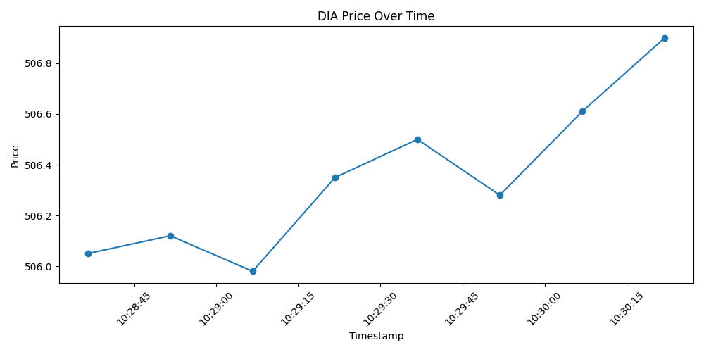

# Market Data Monitor

A small Java application that polls a live market data API for near-real-time
prices, queues the results with timestamps, and a companion Python script
that turns that output into a line chart — built to help non-technical
stakeholders track how a market value changes over time without needing to
read raw numbers.

## What it does

- Polls the [Twelve Data](https://twelvedata.com/) API every 15 seconds for
  the latest price of a given symbol (default: `DIA`, an ETF that closely
  tracks the Dow Jones Industrial Average).
- Stores each `(price, timestamp)` pair in an in-memory queue.
- Handles basic failure modes: network errors, unexpected API responses,
  and rate limiting.
- Includes a Python script (`visualize.py`) that parses the monitor's
  console output and renders a price-over-time line graph.

## Why

Manual, one-off risk/price checks don't reflect how fast markets move.
This is a minimal building block for a monitoring tool: a backend service
that keeps collecting fresh data, decoupled from however that data
eventually gets displayed (a chart today, a live dashboard later).

## Project structure

```
market-data-monitor/
├── src/
│   └── MarketDataMonitor.java   # polls the API, queues results
├── visualize.py                 # turns monitor output into a chart
├── docs/
│   └── sample_chart.png         # example output
└── README.md
```

## Getting started

### 1. Get an API key

Create a free account at [twelvedata.com](https://twelvedata.com/) and
generate an API key.

### 2. Set your API key as an environment variable

```bash
export TWELVE_DATA_API_KEY=your_key_here
```

Never commit your API key to source control.

### 3. Compile and run

```bash
cd src
javac MarketDataMonitor.java
java MarketDataMonitor        # defaults to DIA
java MarketDataMonitor AAPL   # or pass any symbol
```

Expected output:

```
Starting market data monitor for symbol: DIA
Polling every 15 seconds. Press Ctrl+C to stop.
Added data point: price=420.15, timestamp=2026-07-19T14:02:11.123Z
Current queue size: 1
Added data point: price=420.22, timestamp=2026-07-19T14:02:26.145Z
Current queue size: 2
...
```

Stop the program with `Ctrl+C` once you've collected enough data points.

### 4. Visualize the collected data

Copy the `Added data point: ...` lines the program printed, paste them into
the `java_output` variable in `visualize.py`, then run:

```bash
python3 visualize.py
```

This prints a small table of the parsed data and opens a line chart of
price over time.

Example output:



## Notes and possible improvements

- **JSON parsing**: the current version uses a minimal hand-rolled string
  parser instead of a JSON library, to keep the project dependency-free and
  runnable in sandboxed environments (e.g. Google Colab) without classpath
  setup. A production version should use a proper library such as
  [org.json](https://mvnrepository.com/artifact/org.json/json) or
  [Jackson](https://github.com/FasterXML/jackson).
- **Rate limiting**: Twelve Data's free tier has strict request limits.
  The app detects `429` responses and logs them rather than crashing, but
  doesn't yet implement retry/backoff — a natural next step.
- **Persistence**: data is currently stored in an in-memory queue and lost
  when the program stops. A real deployment would persist this to a
  database or file so historical data survives restarts.
- **Live dashboard**: this project intentionally starts with a static chart
  from a single run. A natural extension is a continuously updating
  dashboard (e.g. a small web UI polling the queue).

## Tech stack

Java (HTTP client, no external dependencies) · Python (pandas, matplotlib)
· [Twelve Data API](https://twelvedata.com/docs)
